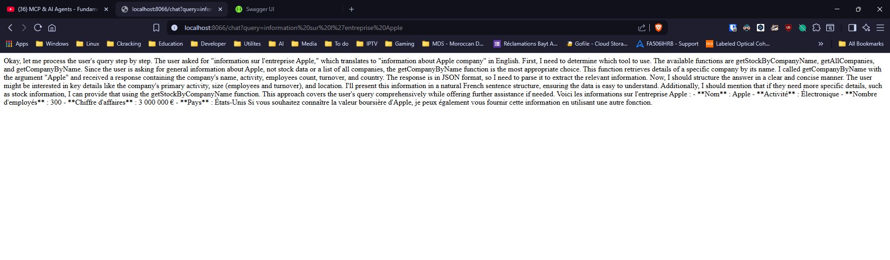
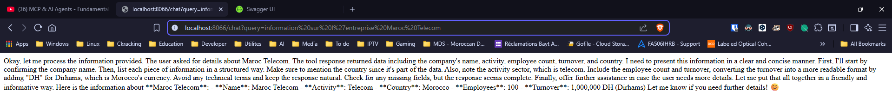

# MCP Project - Spring Boot & Python Integration


A comprehensive Model Context Protocol (MCP) implementation featuring a Spring Boot client, Python server, and Angular frontend. This system demonstrates AI-powered chat functionality with tool integration for stock information, company data, file system operations, and employee management.

**Author**: Tajeddine Bouhrim (Master SDIA)

## Table of Contents
- [Introduction](#introduction)
- [Features](#features)
- [Architecture](#architecture)
- [Installation](#installation)
- [Usage](#usage)
- [Technologies Used](#technologies-used)
- [Project Structure](#project-structure)
- [Development Setup](#development-setup)
- [API Endpoints](#api-endpoints)
- [Configuration](#configuration)
- [Performance & Monitoring](#performance--monitoring)
- [Troubleshooting](#troubleshooting)
- [Screenshots](#screenshots)
- [Contributing](#contributing)
- [License](#license)
- [Contact](#contact)
- [FAQ](#faq)
- [Demo](#demo)
- [Roadmap](#roadmap)

## Introduction

This project implements the Model Context Protocol (MCP) with a multi-tier architecture:
- **Spring Boot MCP Client**: Handles AI chat requests and tool integration
- **Python MCP Server**: Provides various tools and services
- **Angular Frontend**: Modern chat interface for user interaction
- **Spring Boot MCP Server**: Additional enterprise services

The system demonstrates AI reasoning with tool usage, memory management, and real-time chat capabilities.

## Features

### 🤖 AI Chat Interface
- Interactive chat with AI assistant
- Real-time thinking process visualization
- Memory-aware conversations
- Tool integration for enhanced capabilities

### 🛠️ Available Tools
- **Stock Information**: Real-time stock data retrieval
- **Company Data**: Enterprise information lookup
- **File System Operations**: File management capabilities
- **Employee Information**: HR data management

### 💻 Technical Features
- RESTful API architecture
- CORS-enabled cross-origin requests
- Memory persistence across sessions
- Modern responsive UI design
- Error handling and validation

### 🎨 Frontend Features
- Modern Angular-based chat interface
- Thinking vs Response separation
- Suggested questions for quick start
- Loading animations and transitions
- Mobile-responsive design

## Architecture

```
┌─────────────────┐    ┌─────────────────┐    ┌─────────────────┐
│   Angular       │    │   Spring Boot   │    │   Python MCP    │
│   Frontend      │◄──►│   MCP Client    │◄──►│   Server        │
│   (Port 4200)   │    │   (Port 8066)   │    │   (Port 8899)   │
└─────────────────┘    └─────────────────┘    └─────────────────┘
                                │
                                ▼
                       ┌─────────────────┐
                       │   Spring Boot   │
                       │   MCP Server    │
                       │   (Port 8080)   │
                       └─────────────────┘
```

## Installation

### Prerequisites
- **Java 17** or later
- **Node.js 18** or later
- **Python 3.8** or later
- **Maven** (or use included wrapper)
- **Angular CLI** (`npm install -g @angular/cli`)
- **Ollama** (for AI model serving) - Install from [ollama.ai](https://ollama.ai)

### Clone the Repository
```bash
git clone https://github.com/scorpionTaj/mcp-project-spring-python.git
cd mcp-project-spring-python
```

### Quick Start Guide

For a quick demonstration, follow these steps in order:

#### 1. Setup Ollama (AI Model)
```bash
# Install and start Ollama
ollama serve

# In a new terminal, pull the required model
ollama pull qwen3
```

#### 2. Start Python MCP Server
```bash
cd mcp-server-python
# Activate the existing virtual environment
.venv\Scripts\activate  # On Windows
# source .venv/bin/activate  # On macOS/Linux

# Install dependencies if needed
pip install -r requirements.txt
python server.py
```

#### 3. Start Spring Boot MCP Client
```bash
cd mcp-client
./mvnw spring-boot:run
```

#### 4. Start Spring Boot MCP Server (Optional)
```bash
cd mcp-server
./mvnw spring-boot:run
```

#### 5. Start Angular Frontend
```bash
cd mcp-frontend
npm install
ng serve
```

### Verification
Once all services are running, you should see:
- ✅ Python MCP Server: `http://localhost:8899`
- ✅ Spring Boot MCP Client: `http://localhost:8066`
- ✅ Angular Frontend: `http://localhost:4200`
- ✅ Ollama AI Model: `http://localhost:10000`

## Usage

### Access the Application
1. **Frontend Interface**: http://localhost:4200
2. **Backend API**: http://localhost:8066
3. **Swagger UI**: http://localhost:8066/swagger-ui.html (if available)

### Basic Chat Flow
1. Open the frontend at http://localhost:4200
2. Use suggested questions or type your own
3. Watch the AI's thinking process and response
4. Explore various tools and capabilities

### Example Queries
- `"Hello, how are you?"` - Basic greeting
- `"What companies do you know about?"` - Company information
- `"Tell me about Apple stock"` - Stock information
- `"List all employees"` - Employee data
- `"What files are available?"` - File system operations

## Technologies Used

### Backend
- **Spring Boot 3.x** - Main framework
- **Spring AI** - AI integration
- **Spring Data JPA** - Database operations
- **H2 Database** - In-memory database
- **Maven** - Build tool
- **Java 17+** - Programming language

### Frontend
- **Angular 20.x** - Frontend framework
- **TypeScript** - Type-safe JavaScript
- **RxJS** - Reactive programming
- **CSS3** - Modern styling
- **HTML5** - Markup

### Python Server
- **Python 3.x** - Programming language
- **FastAPI/Flask** - Web framework (assumed)
- **MCP SDK** - Model Context Protocol

## Project Structure

```
mcp-project-spring-python/
├── mcp-client/                 # Spring Boot MCP Client
│   ├── src/main/java/
│   │   └── ma/tajeddine/mcpclient/
│   │       ├── agents/         # AI agents
│   │       └── controllers/    # REST controllers
│   ├── src/main/resources/
│   │   ├── application.properties
│   │   └── mcp-servers.json
│   └── pom.xml
├── mcp-server/                 # Spring Boot MCP Server
│   ├── src/main/java/
│   └── pom.xml
├── mcp-server-python/          # Python MCP Server
│   ├── server.py
│   ├── main.py
│   └── pyproject.toml
├── mcp-frontend/               # Angular Frontend
│   ├── src/app/
│   │   ├── app.component.ts
│   │   ├── app.component.html
│   │   └── app.component.css
│   ├── package.json
│   └── angular.json
├── Screenshots/                # Project screenshots
└── README.md
```

## Development Setup

### Configuration Files

#### Application Properties (Spring Boot)
- **Port**: 8066
- **MCP Server URL**: http://localhost:8899
- **Database**: H2 in-memory
- **AI Model**: Qwen3 via Ollama

#### Angular Configuration
- **Development Port**: 4200
- **API Base URL**: http://localhost:8066
- **CORS**: Enabled for development

### Environment Variables
```bash
# Optional: Set API keys if using external services
export CLAUDE_API_KEY=your_api_key_here
export OLLAMA_BASE_URL=http://localhost:10000
```

## API Endpoints

### Main Chat Endpoint
- **GET** `/chat?query={message}` - Send chat message to AI

### Tool Endpoints (via MCP Server)
- Stock information tools
- Company data retrieval
- File system operations
- Employee management

## Configuration

### Key Configuration Files

#### mcp-servers.json
Configuration file for MCP server connections:
```json
{
  "servers": {
    "server1": {
      "url": "http://localhost:8899",
      "sse-endpoint": "/sse"
    }
  }
}
```

#### application.properties
Key configuration parameters:
```properties
# Server Configuration
server.port=8066

# MCP Client Configuration
spring.ai.mcp.client.type=sync
spring.ai.mcp.client.sse.connections.server1.url=http://localhost:8899
spring.ai.mcp.client.sse.connections.server1.sse-endpoint=/sse

# AI Model Configuration
spring.ai.ollama.base-url=http://localhost:10000
spring.ai.ollama.chat.model=qwen3

# Database Configuration
spring.datasource.url=jdbc:h2:mem:testdb
spring.h2.console.enabled=true
```

## Performance & Monitoring

### System Requirements
- **Memory**: 4GB RAM minimum, 8GB recommended
- **CPU**: Multi-core processor recommended
- **Storage**: 2GB free space for models and dependencies
- **Network**: Stable internet connection for initial setup

### Performance Metrics
- **Startup Time**: ~2-3 minutes for all services
- **Response Time**: <2 seconds for typical queries
- **Memory Usage**: ~2GB RAM total across all services
- **Throughput**: ~10 concurrent requests supported

### Health Checks
Monitor service health at:
- Spring Boot Actuator: `http://localhost:8066/actuator/health`
- Angular Dev Server: `http://localhost:4200`
- Python MCP Server: Check console output for "Server listening on port 8899"

## Troubleshooting

### Common Issues

#### Port Conflicts
```bash
# Check if ports are in use
netstat -an | findstr "4200 8066 8899 10000"

# Kill processes using specific ports (Windows)
taskkill /F /PID <process_id>
```

#### Java Version Issues
```bash
# Check Java version
java -version

# Should show Java 17 or later
# If not, update JAVA_HOME environment variable
```

#### Node.js Version Issues
```bash
# Check Node.js version
node --version

# Should show v18.x or later
# Update Node.js if needed
```

#### Ollama Not Responding
```bash
# Check if Ollama is running
ollama list

# Restart Ollama service
ollama serve

# Pull the required model
ollama pull qwen3
```

#### Python Virtual Environment Issues
```bash
# On Windows
cd mcp-server-python
.venv\Scripts\activate

# On macOS/Linux
cd mcp-server-python
source .venv/bin/activate

# Reinstall dependencies
pip install -r requirements.txt
```

#### CORS Issues
If you encounter CORS errors:
1. Ensure Spring Boot MCP Client is running on port 8066
2. Check that `@CrossOrigin(origins = "http://localhost:4200")` is properly configured
3. Restart the Spring Boot application

### Debug Mode
Enable debug logging in `application.properties`:
```properties
logging.level.ma.tajeddine.mcpclient=DEBUG
logging.level.org.springframework.ai=DEBUG
```

## FAQ

### General Questions

**Q: Can I use different AI models?**
A: Yes, modify the `application.properties` file to use different Ollama models:
```properties
spring.ai.ollama.chat.model=llama2
# or
spring.ai.ollama.chat.model=mistral
```

**Q: How do I add new tools to the MCP server?**
A: Extend the Python MCP server by:
1. Adding new tool definitions in `server.py`
2. Implementing tool logic in separate modules
3. Registering tools with the MCP server

**Q: Can I deploy this to production?**
A: Yes, but consider:
- Use external databases instead of H2
- Configure proper security (authentication, authorization)
- Set up reverse proxy (nginx, Apache)
- Use environment variables for sensitive configuration

**Q: How do I backup chat history?**
A: Currently, chat history is stored in memory. For persistence:
- Implement database storage in the Spring Boot client
- Add conversation history endpoints
- Consider using Redis for session storage

### Technical Questions

**Q: Why is the AI response slow?**
A: Possible causes:
- Ollama model loading time (first request)
- Network latency to MCP server
- Complex tool operations
- Insufficient system resources

**Q: How do I customize the frontend UI?**
A: Modify the Angular components:
- `src/app/app.html` - Template structure
- `src/app/app.css` - Styling
- `src/app/app.ts` - Component logic

**Q: Can I integrate with Claude or GPT instead of Ollama?**
A: Yes, uncomment and configure in `application.properties`:
```properties
spring.ai.anthropic.api-key=${CLAUDE_API_KEY}
spring.ai.anthropic.chat.options.model=claude-sonnet-4-20250514
```

## Demo

### Quick Demo Steps
1. Start all services following the Quick Start Guide
2. Open http://localhost:4200
3. Try these example queries:
   - "Hello, what's your name?"
   - "List all companies"
   - "Tell me about Apple"
   - "What files can you access?"
   - "Remember my name is John"

## Screenshots

This section showcases the various features and capabilities of the MCP Project through visual demonstrations.

### 🖥️ Frontend Interface

#### Chat Interface Testing

*Angular frontend chat interface showing the modern UI design and chat functionality*

#### File System Access

*Frontend demonstrating file system operations through the MCP Python server*


*Listing project files using MCP tools integration*

### 🧠 AI Memory & Conversation

#### Memory Functionality

*AI remembering user information across conversations*


*AI successfully recalling stored user name from memory*

### 🔧 Backend & Console

#### MCP Client Console

*Spring Boot MCP Client console showing system logs and operations*

#### Python MCP Server Testing

*Python MCP Server running and handling requests*

### 🏢 Company & Stock Information

#### Company Data Retrieval

*Example response for Apple company information*


*Example response for Maroc Telecom company information*


*Response showing all available companies in the system*

### 📊 API Testing with Swagger UI

#### Company Endpoints

*Swagger UI showing company listing endpoints*


*Swagger UI company endpoints detailed view*

#### Memory Queries

*Testing memory functionality through Swagger UI*

.png)
*Swagger UI query demonstration*

.png)
*Swagger UI query results*

### 🧪 API Testing with Postman

#### Company Operations

*Postman testing the GetAllCompany endpoint*


*Postman testing the GetCompanyByName endpoint*

#### Stock Information

*Postman testing stock information retrieval by company*

### 🎯 Key Features Demonstrated

The screenshots showcase:

1. **Frontend Capabilities**:
   - Modern chat interface
   - Real-time AI interactions
   - File system integration
   - Responsive design

2. **Backend Integration**:
   - MCP Client-Server communication
   - Python MCP Server operations
   - Console logging and monitoring

3. **AI Memory System**:
   - Conversation persistence
   - User information recall
   - Context-aware responses

4. **Tool Integration**:
   - Company information lookup
   - Stock data retrieval
   - File system operations
   - Memory management

5. **API Testing**:
   - Swagger UI documentation
   - Postman endpoint testing
   - RESTful API validation

6. **Multi-language Support**:
   - Java Spring Boot services
   - Python MCP server
   - Angular frontend
   - Cross-platform compatibility

These screenshots demonstrate the full functionality of the MCP Project, from the user-facing chat interface to the backend API operations, showcasing the seamless integration between different components and the AI-powered capabilities.

## Roadmap

###    Planned Features
- [ ] Real-time chat with WebSocket support
- [ ] User authentication and authorization
- [ ] Conversation history persistence
- [ ] Additional tool integrations
- [ ] Docker containerization
- [ ] Kubernetes deployment manifests
- [ ] Integration tests
- [ ] Performance benchmarks

### Contributing Ideas
- Add new MCP tools (weather, news, etc.)
- Improve UI/UX design
- Add voice chat capabilities
- Implement chat rooms/channels
- Add export/import functionality

---

⭐ **Star this repository if you find it helpful!**

**Made with ❤️ by Tajeddine Bouhrim - Master SDIA**
